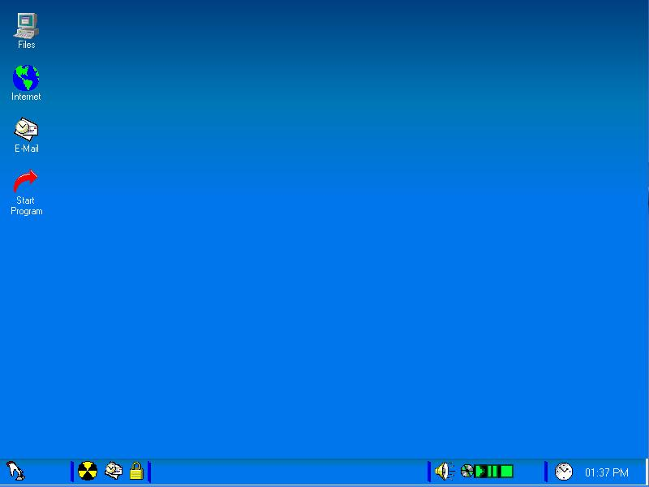

<div align="center">

## Nexcon Shell Replacement Update \(Version 1\.1\.0\)


</div>

### Description

This is just an updated version of my shell replacement named Nexcon.

Nexcon Shell Replacement Includes a whole ton of features. You will just need to check out the program to find out.

Please note that the screenshot is from version 1(not much has changed with the GUI though).

Please download it and try it out. You don't need to vote just please leave a comment and tell me what you think so I can improve it.

If you look through the code you'll see parts of a network OS. Not finished yet though.
 
### More Info
 


<span>             |<span>
---                |---
**Submitted On**   |2002-05-30 21:34:22
**By**             |[\-=TheASP=\-](https://github.com/Planet-Source-Code/PSCIndex/blob/master/ByAuthor/theasp.md)
**Level**          |Intermediate
**User Rating**    |5.0 (10 globes from 2 users)
**Compatibility**  |VB 6\.0
**Category**       |[Complete Applications](https://github.com/Planet-Source-Code/PSCIndex/blob/master/ByCategory/complete-applications__1-27.md)
**World**          |[Visual Basic](https://github.com/Planet-Source-Code/PSCIndex/blob/master/ByWorld/visual-basic.md)
**Archive File**   |[Nexcon\_She886135302002\.zip](https://github.com/Planet-Source-Code/theasp-nexcon-shell-replacement-update-version-1-1-0__1-35308/archive/master.zip)

### API Declarations

```

If User.Likes("Nexcon Shell Replacement") then
User.Goto("computer")
User.Navigate("http://www.planet-source-code.com/")
User.Vote(Excellent, "Nexcon Shell Replacement")
else
User.Goto("computer")
User.Navigate("mailto:aspippin@accesscomm.ca")
User.Explain(InEmail, "why user doesn't like program")
end if
```


